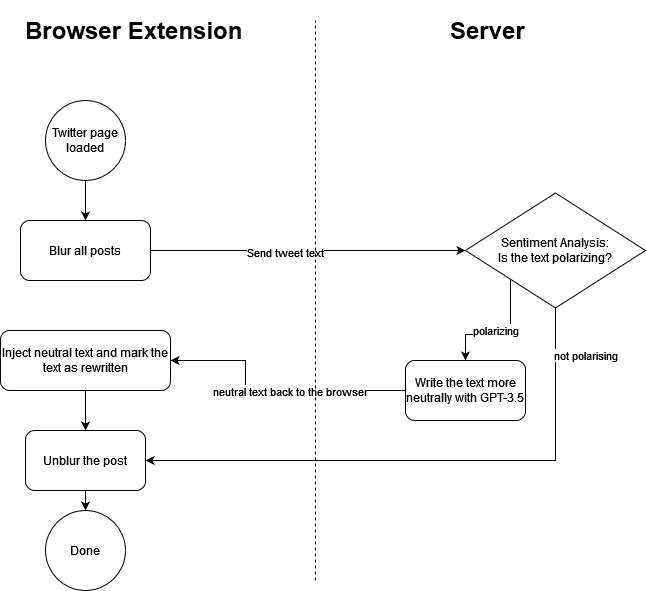

# safe_
Pronounced "_safespace_"

A HSLU HackSTAIR project in the middle of October 2023.

## Goal
Protecting [Twitter](https://twitter.com) users from polarizing, overly negative, or hurtful content through sentiment analysis.

## How it works

# Usage

## Prerequisites
- Compatible Browser: [Google Chrome](https://www.google.com/chrome/) or [Microsoft Edge](https://www.microsoft.com/en-us/edge/download)
- Twitter account

### Variant 1: Hosted API
_**recommended**, only inside HSLU network_

1. [Install the Browser Extension](#install-browser-extension)
2. Open Twitter in your browser & login.
3. enjoy using Twitter with safe_

### Variant 2: run everything locally
_designed for local testing_

1. Install python 3.11
2. Clone this repository
3. Open the `api_project` subfolder in a command line
4. run `pip install -r requirements.txt` to install dependencies
5. run `python -m uvicorn main:app --host 0.0.0.0 --port 8000`
6. Make sure to allow TCP Port 8000 in your local firewall

## Install Browser Extension
1. Clone this repository (if not done already)
2. Configure your browser to allow insecure content for `twitter.com`
See detailed Instructions for [Google Chrome](#enable-insecure-content-in-google-chrome) and [Microsoft Edge](#enable-insecure-content-in-microsoft-edge)
3. Manage Extensions - turn on developer mode
4. Manage Extensions - "Load unpacked" and browse to `<Repo>/client/addon`

### Enable insecure content in Google Chrome
1. Open Google Chrome Settings
2. Search for "insecure"
3. Go to "Site Settings"
4. Scroll down to "Additional content settings"
5. Open "Insecure content" and add `twitter.com` to "Allowed to show insecure content"

### Enable insecure content in Microsoft Edge
1. Open Microsoft Edge Settings
2. Scroll down to "Insecure content"
3. Open "Insecure content" and add `twitter.com` under "Allow"

## Team
- Robin Matter
- Said Aroua
- Nicola Le
- Joël Ammann